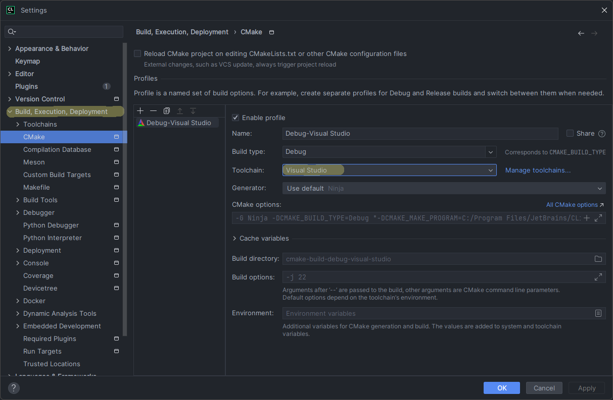

# Compiling on Windows
## Requirements
As of now, the only supported/tested compiler on Windows is MSVC. This is packaged with Visual Studio, you can download the Community version for free here:
- https://visualstudio.microsoft.com/

You can use the Visual Studio compiler to compile through [CLion][clion] if that's what you're using. Just make sure your cmake profile is set to use Visual Studio as its toolchain.

If you want to compile through the windows command-line you will need to install:
- [cmake][cmake] for Windows
- A build system like [make][make] or [ninja][ninja] for Windows
- [MSVC Build Tools][msvc]

[cmake]: https://cmake.org/download/
[make]: https://gnuwin32.sourceforge.net/packages/make.htm
[ninja]: https://ninja-build.org/ 
[msvc]: https://learn.microsoft.com/en-us/cpp/build/building-on-the-command-line?view=msvc-170
[clion]: https://www.jetbrains.com/clion/

## Compiling
### CLion
If you've set your toolchain to use Visual Studio, simply hit the hammer icon to build. You should see it output a new folder with the executable and other build files.

### Command-Line
If you've already downloaded the MSVC Build Tools, you should have access to the `CL` command-line tool[^1].
Now that you have it you should be ready to compile. Make sure you're in the project directory and run the following commands[^2]:
1. `mkdir build`
2. `cd build`
3. `cmake ..`
4. `cmake --build . --target commander`

This builds and compiles the commander executable.

[^1]: If you've downloaded the Build Tools, but can't run `CL` in the command-line. Try to use a [Developer][developer] Powershell/Command-Line.
[^2]: These commands are for PowerShell

[developer]: https://learn.microsoft.com/en-us/visualstudio/ide/reference/command-prompt-powershell?view=vs-2022