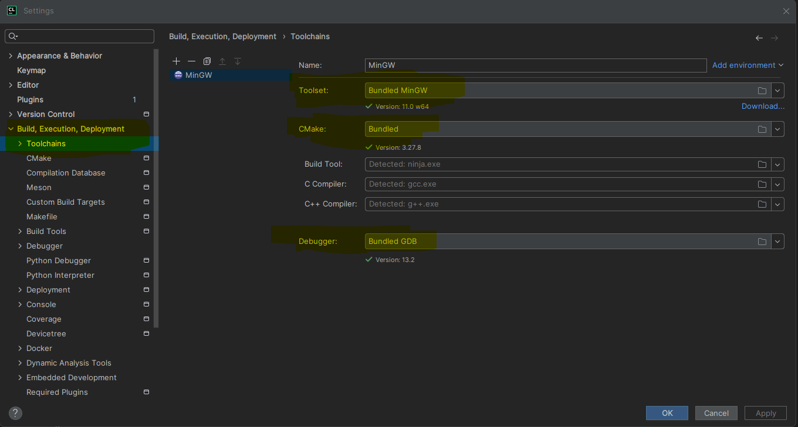
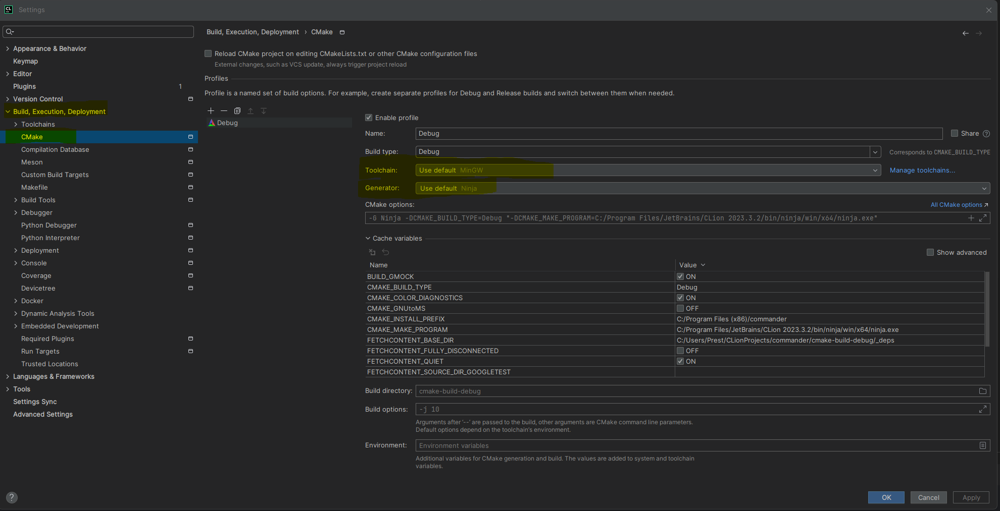
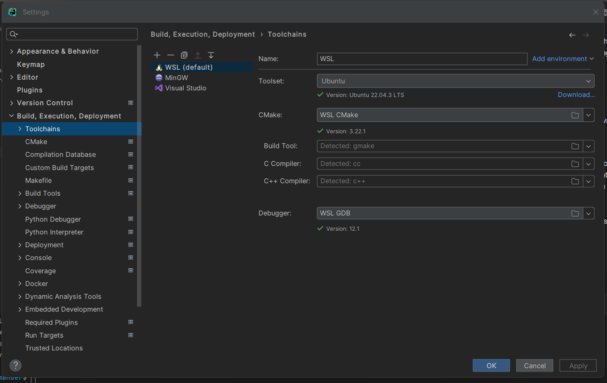

# Setup

## CLion IDE

CLion is the recommended IDE to use due to it's many features to help developers write C++ code, but other IDEs like VSCode, Vim, etc. can also be great choices. To use CLion:

1. First download it. You can either do this directly from their [website](https://www.jetbrains.com/clion/download/), or you can do this through [JetBrains toolbox](https://www.jetbrains.com/toolbox-app/), which is a good choice if you happen to use other JetBrains products.
2. Run through installation.
3. CLion requires a license in order to use it. As a student, you can use it for free by creating an account [here](https://www.jetbrains.com/shop/eform/students) and sign into CLion with it to redeem a license that allows you to use it for up to a year before redeeming again.

## Building

It goes without saying that you will need a C++ compiler in order to build the project. There are many options for this, including GCC and Clang++. For an example, here's how you might install Clang++ (assuming you are using Ubuntu Linux):
```console
~$ sudo apt-get install clang++
```
Here are the steps for building:
1. Clone the repo.
2. Install CMake (if not installed).
3. Run CMake using the CMakeLists.txt file in the base directory of the repo.
4. Install Make (if not installed).
5. Run Make using the generated Makefile(s) from CMake
6. Run the interpreter/tests.

Here's an example of how this might look like via the terminal on a Linux Ubuntu distro (which works for WSL):
1. ```console
   ~$ git clone https://capstone-cs.eng.utah.edu/commander/commander.git
   ```
2. ```console
   ~$ sudo apt-get install cmake
   ```
3. ```console
   ~$ cd commander
   ~/commander$ mkdir build
   ~/commander$ cd build
   ~/commander/build$ cmake ..
   ```
4. ```console
   ~/commander/build$ sudo apt-get install make
   ```
5. ```console
   ~/commander/build$ make
   ```
6. ```console
   ~/commander/build$ ./commander
   ~/commander/build$ ./lexerTests
   ```
With CLion, it should automatically detect the CMakeList.txt file when you open the project directory in CLion (the "commander" directory in the example above). This means that it will know how to build everything when you try to run the interpreter or tests within CLion. Note that dependencies such as GoogleTest will be automatically downloaded when building using CMake.

Note that you may need to download the ncurses library for Linux if it isn't already included in your system.

Additionally, if you are compiling on Windows, there is special documentation on how to specifically do that [here](compiling.md).

## Windows CLion

When using CLion on Windows, we have run into some known issues with getting it to work well for the project, so here are those issues and the solutions to them:

1. When you use CLion purely on Windows (not with WSL or other machine that you connect to), you must ensure that you are using all the bundled configurations. That is, you need to make sure in the settings that you are using the bundled MinGW, bundled Ninja, bundled CMake, and bundled GDB as we found this guarantees that the builds will work. If using any of them non-bundled, there is no guarantee that it will work. See images below for what it should look like in the settings:



2. If keeping your project in WSL, make sure to create a WSL toolchain in the settings for best results. Do NOT use remote development, as this requires installing CLion onto WSL and running it there instead of on the Windows host machine, which turns out to be much slower. See screenshot below for what this looks like in the settings:
